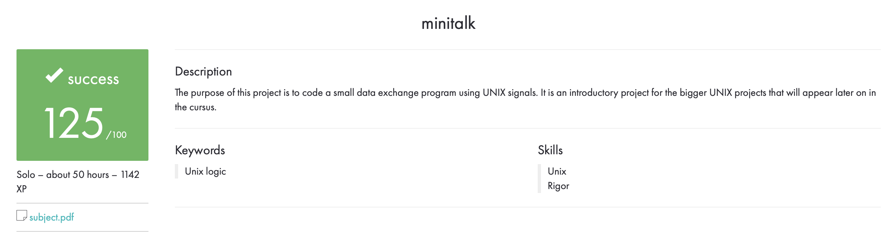

# MiniTalk

MiniTalk is a project for 42 school that aims to create a simple chat application using TCP/IP sockets. The program allows users to send and receive messages between multiple clients connected to a server.

## Getting Started

To start using MiniTalk, you need to clone the repository from the 42 school GitLab. Once you have the source code, compile it using the make command. After compiling, you can run the server and client programs.

## Using MiniTalk

To use MiniTalk, start the server program by running the command `./server`. This will start the server and allow clients to connect.

Next, start the client program by running the command `./client [server address] [port]`. Replace [server address] with the IP address or domain name of the server, and replace [port] with the port number that the server is listening on.

Once the client is connected to the server, you can start sending and receiving messages. To send a message, simply type it into the command prompt and press enter. To exit the program, type `/exit` and press enter.

## Features

MiniTalk includes the following features:

- Sending string from client to host.

## Authors

MiniTalk was created by Hyunah. If you have any questions or feedback, please feel free to contact us.

## Acknowledgements

We would like to thank 42 school for providing us with the opportunity to work on this project and learn new skills.
